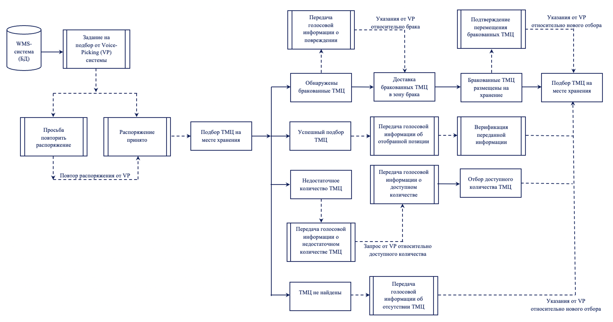
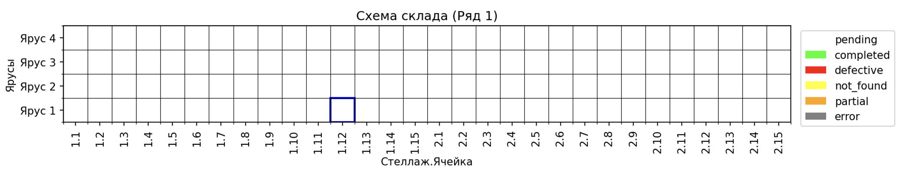
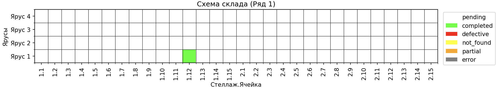

# Voice-assistant

## Разработка системы голосового управления отбором заказов (Voice-Picking, VP) 

Система разрабатывается для повышения производительности операций по отбору товаров и отгрузки небольших партий (меньше коробки) сборного груза физическим лицам, а также сокращения количества ошибок, возникающих при отборе с использованием ручного терминала сбора данных. Возникновение ошибок обусловлено снижением уровня концентрации внимания сотрудников вследствие необходимости отвлекаться на считывание штрих-кодов при помощи ручного терминала сбора данных.

Для внедрения предлагаемой системы необходимо снабдить каждого сборщика гарнитурой и микрокомпьютером – система децентрализована, обработка заказов происходит непосредственно у сборщика. 

В рамках системы решаются две задачи для осуществления голосового управления процессом:
1.	Генерация голосовых команд по отбору позиций заказа (синтез речи).
2.	Распознавание ответа сборщика (распознавание речи).

Кроме того, распознанная из ответа сборщика информация о позиции заказа проходит верификацию на соответствие информации из базы данных (БД), на основе которой генерируется голосовая команда.

Прототип системы использовал популярную модель Whisper для распознавания речи, однако в результате тестирования работы системы, было принято решение заменить данную модель на русскоязычную (модель Whisper, имела особенность, связанную с её мультиязычностью, которая проявлялась в том, что данная модель переводила фразы, произнесенные на русском языке – на английский, либо транслитерировала фразы латиницей). Для синтеза речи прототип использовал модель XTTS-v2, позволяющую получать качественные и естественные генерации за счет клонирования сэмпла голоса, однако также была заменена на другую модель из-за медленной скорости генерации.  

Для создания системы были использованы предобученные русскоязычные модели: Silero v4_ru для генерации голосовых команд, GigaAM v2_ctc для распознавания ответа сборщика. Выбранные модели были интегрированы в единую систему при помощи кода, приведенного в приложении А. Архитектура системы содержит следующие основные компоненты, которые разрабатывались последовательно:
-	База данных SQLite – хранение заказов и логов аудио; 
-	Модуль синтеза речи (TTS) – преобразование текста в речь; 
-	Модуль распознавания речи (ASR) – преобразование речи в текст; 
-	Аудиомодуль – запись и обработка аудиоданных; 
-	Модуль верификации – сверка информации с БД;
-	Модуль визуализации – графическое отображение состояния склада; 
-	Логирование – фиксация всех операций системы для отчетности и наглядности.

Модели применяются последовательно в рамках системы: сначала Silero v4_ru генерирует голосовое распоряжение относительно отбора, ответ сборщика (принятие распоряжения или передача дальнейшей информации) записывается на устройство и распознается моделью GigaAM v2_ctc, которая выдает транскрипцию аудио. Затем модуль верификации сверяет извлеченную из транскрибированного текста необходимую информацию при помощи простого строкового сравнения с ожидаемым типом ответа или соответствующей информацией из БД. Процесс верификации в системе представляет собой многоуровневую проверку корректности выполнения операций, которая включает несколько этапов подтверждения данных и действий: 
-	Первичная верификация (подтверждение команды);
-	Верификация данных отбора (основной этап); 
-	Верификация особых случаев (товар бракован, товар не найден, не хватает единиц товара); 
-	Визуальная верификация.

Отбор заказа при помощи системы осуществляется следующим образом:
1.	Система получает из базы данных информацию о позиции заказа (номер позиции, ряд, стеллаж, ярус, ячейка, код и количество товара к отбору) и на ее основе генерирует голосовую команду, которая поступает сборщику.
2.	Сборщик принимает задачу путем произнесения ответа «Принято» либо просит систему повторить команду и после переходит к отбору товара в соответствии с озвученной информацией. 
3.	В системе установлена задержка перед распознаванием последующего ответа сборщика с учетом стандартизации выполнения операций в данном фулфилмент-центре.
4.	Последующий ответ сборщика поступает, распознается и обрабатывается системой согласно одному из 4 сценариев: 

  	4.1. Сообщение об отсутствии необходимого количества товара. Система просит сборщика назвать доступное количество. После распознавания названного сборщиком количества, система обновляет статус позиции заказа в БД на «частично выполнено» с указанием отобранного количества и переходит к следующей позиции.

  	4.2. Сообщение об отсутствии товара. Система обновляет статус позиции на «не найдено» и переходит к следующей.

  	4.3. Сообщение о браке товара. Система генерирует голосовое указание относительно места размещения бракованного товара и просит сборщика подтвердить перемещение. После получения подтверждения, система обновляет статус позиции на «браковано» и переходит к следующей.

  	4.4. При успешном завершении отбора позиции заказа, сборщик подтверждает выполнение команды путем произнесения слова «Готово» и повторения информации из команды. Извлеченная из ответа сборщика информация о позиции проходит верификацию на соответствие указанной в команде: 

      -	В случае совпадения всех данных, система обновляет статус позиции на «выполнено» и переходит к следующей.
      -	В случае расхождений или неполной информации, система голосом сообщает сборщику о проблеме и запрашивает повторный ответ.
        
5.	После обработки всех позиций заказа, система сообщает сборщику о необходимости перейти в зону упаковки.

В процессе отбора система также визуализирует состояние склада перед отбором позиции и после: на экране устройства выводится схема склада с соответствующим выделением цветом ячейки.

Последующие этапы доработки системы предусматривают:
1.	Анализ необходимости и степени дообучения используемых предобученных моделей на собственном наборе данных для повышения качества распознавания и синтеза речи.
2.	Интеграция алгоритма обнаружения голосовой активности (Voice Activity Detection, VAD) с целью обеспечения гибкой записи и распознавания ответа сборщика.
3.	Добавление продвинутых модулей обработки и понимания естественного языка (Natural Language Processing, NLP; Natural Language Understanding, NLU) для повышения эффективности обработки ответов сборщика с учетом ошибок в их распознавании и расширения их разнообразия.
4.	Добавление поддержки альтернативных моделей синтеза речи для предоставления выбора голосов и качества синтеза сборщику.
5.	Добавление функционала для анализа времени выполнения заказов, частоты ошибок и других метрик.
6.	Оптимизация системы для микрокомпьютера.
7.	Интеграция с WMS-системой.
   
Система может быть использована как для многопрофильного предприятия, так и для специализированного. По сравнению с бумажной технологией, применяемой для отгрузки однотипной продукции, эффект от внедрения системы будет значительнее. Кроме того, для предприятий с высокой интенсивностью потока заказов эффективность решения будет выше.
